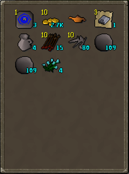

# Inventory Banked Counter

Shows how many of each inventory item you also have in your bank, drawn directly on the item in your inventory. For example, if you're carrying 1 coal and have 24 banked, the overlay shows "24" on that slot.

Bank contents are only known once you've opened your bank during the current session — nothing is shown before then.

## Features

- Banked-count overlay on inventory items, with configurable text color and font size
- Optional shorthand numbers for large counts (1.2K / 1.2M / 1.2B), toggleable in settings
- Shift+right-click an inventory item for an "Exclude from banked count" / "Include in banked count" option, or manage the exclusion list directly in the plugin settings
